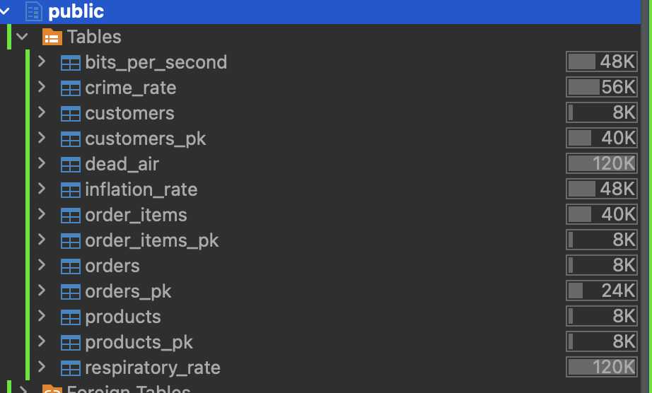

@Author: Shoaib Rahman


# Automated Primary Key Discovery Using Combinatorial Sieve and Graph Neural Networks

An intelligent system for automated primary key discovery in relational databases that combines a multi-phase combinatorial sieve with Graph Attention Networks (GAT) and PageRank-based structural analysis to identify optimal primary key candidates without requiring prior schema knowledge.

## Key Features

### Phase 1: Data Ingestion
- Automatic database connection and metadata extraction
- Table data loading with SQLAlchemy support
- Handles PostgreSQL and other relational databases

### Phase 2: Combinatorial Sieve
- **Single Column Analysis**: Identifies columns with perfect uniqueness and no nulls
- **Priority-Based Scoring**: 
  - Level 1 (High): Direct ID columns (`id`)
  - Level 2 (Medium): Semantic patterns (`customer_id`, `order_key`, `uuid`, `code`, `serial`)
  - Level 3 (Low): Structural candidates (high uniqueness without naming conventions)
- **Date/Timestamp Filtering**: Excludes temporal columns from single-key consideration
- **Composite Key Detection**: Discovers multi-column combinations when single keys are insufficient
- **Synergy Scoring**: Rewards composite keys that include high-priority columns

### Phase 3: Virtual Node Graph Construction
- **Graph Topology**: Constructs a virtual node graph where each candidate is a node
- **Edge Creation Rules**:
  - Semantic similarity between column names (Levenshtein distance > 0.75)
  - Composite hierarchy relationships (subset relationships within same table)
- **PageRank Analysis**: Calculates structural centrality to identify hub columns (likely foreign key references)
- **Feature Engineering**: Combines uniqueness, composite type, and normalized PageRank centrality

### Phase 4: GAT Inference
- Graph Attention Network with multi-head attention mechanism
- Learns structural patterns from schema topology
- Provides confidence scores (0-1) for each candidate
- Attention-based weighting of neighboring candidates

### Phase 5: Optimization & Reporting
- **Smart Ranking**: Combines heuristic scores (h_score) with GNN predictions (g_score)
- **Performance Impact Estimation**:
  - Single keys: 17.7x improvement (Point Lookup)
  - Composite keys: 3.4x improvement (Join/Sort optimization)
- **Adaptive SQL Generation**:
  - Single keys (rank > 1.5): `ALTER TABLE ADD PRIMARY KEY`
  - Composite keys (rank > 1.2): `CREATE UNIQUE INDEX CONCURRENTLY`
- **Confidence Thresholds**: Different thresholds for single vs. composite keys
- **Rejected Candidates Tracking**: Reports valid PK candidates that were filtered out
  - Date/timestamp columns excluded by heuristics
  - Low-confidence candidates below thresholds
  - Alternative candidates for each table

## Project Structure

```
├── models/
│   ├── gcn_model.py          # GCN-based alternative model
│   └── __init__.py
├── scripts/
│   ├── __init__.py
│   ├── gat_model.py          # GAT model with multi-head attention
│   ├── gnn_pipeline.py       # GNN inference and scoring
│   ├── heuristic_filter.py   # Combinatorial sieve with synergy scoring
│   ├── graph_builder.py      # Virtual node graph + PageRank
│   ├── table_identifier.py   # Database metadata extraction
│   ├── utils.py              # Levenshtein distance, data loading
│   └── validation.py         # Candidate validation utilities
├── config.py                 # Environment-based configuration
├── db_connector.py           # SQLAlchemy database connection
├── main.py                   # 5-phase pipeline orchestration
├── requirements.install      # Python dependencies
├── Dockerfile               
├── docker-compose.yml
├── Makefile
└── readme.md
```

## Installation

### Local Setup

1. **Clone the repository**:
```bash
git clone https://github.com/shoaibswe/auto_pk_generator_using_heuristic_and_gnn.git
cd auto_pk_generator_using_heuristic_and_gnn/codes
```

2. **Create and activate virtual environment**:
```bash
python -m venv venv
source venv/bin/activate  # On Windows: venv\Scripts\activate
```

3. **Install dependencies**:
```bash
pip install -r requirements.install
```

Key dependencies:
- PyTorch & PyTorch Geometric (GNN implementation)
- SQLAlchemy (Database connectivity)
- NetworkX (PageRank calculation)
- python-Levenshtein (String similarity)
- NumPy & Pandas (Data processing)

4. **Configure database connection**:

Create a `.env` file:
```env
DB_HOST=localhost
DB_PORT=5432
DB_USER=your_username
DB_PASSWORD=your_password
DB_NAME=your_database
```

### Docker Setup

**Option 1: Pull from Docker Hub**
```bash
docker pull shoaibswe/generate_primary_key
```

**Option 2: Build from source**
```bash
docker-compose build
```

## Usage

### Local Execution

```bash
# Activate virtual environment
source venv/bin/activate

# Run the complete pipeline
python main.py
```

### Docker Compose

```bash
# Start services
make compose-up

# View logs
docker logs python_app_container

# Stop services
make compose-down
```
--- Phase 1: Data Ingestion ---
--- Phase 2: Combinatorial Sieve ---
--- Phase 3: Virtual Node Graph Construction ---
Building Virtual Node Topology...
Graph Constructed: 118 nodes, 2021 edges.
--- Phase 4: GAT Inference ---
--- Phase 5: Optimization & Reporting ---

========================================================================================================================
TABLE                | CANDIDATE KEY                       | TYPE         | H-SCR  | G-SCR  | RANK   | OPT IMPACT
========================================================================================================================
crime_rate           | ID                                  | Single       | 1.00   | 0.70   | 1.70   | 17.7x (Point Lookup)
   [SQL GEN] >> ALTER TABLE crime_rate ADD CONSTRAINT pk_crime_rate PRIMARY KEY ("ID");
------------------------------------------------------------------------------------------------------------------------
inflation_rate       | ID                                  | Single       | 1.00   | 0.70   | 1.70   | 17.7x (Point Lookup)
   [SQL GEN] >> ALTER TABLE inflation_rate ADD CONSTRAINT pk_inflation_rate PRIMARY KEY ("ID");
------------------------------------------------------------------------------------------------------------------------
customers            | customer_id                         | Single       | 0.85   | 0.64   | 1.49   | 17.7x (Point Lookup)
   [REJECTED] Low confidence score (1.49 < 1.50)
------------------------------------------------------------------------------------------------------------------------
orders               | order_id                            | Single       | 0.85   | 0.64   | 1.49   | 17.7x (Point Lookup)
   [REJECTED] Low confidence score (1.49 < 1.50)
------------------------------------------------------------------------------------------------------------------------
### Output Explanation

- **H-SCR (Heuristic Score)**: Based on uniqueness, naming patterns, and composite synergy (0-1)
- **G-SCR (GNN Score)**: Graph neural network confidence based on topology (0-1)
- **RANK**: Combined score = H-SCR + G-SCR (higher is better)
- **OPT IMPACT**: Estimated query performance improvement
- **SQL GEN**: Ready-to-execute DDL statements for high-confidence candidates
- **REJECTED**: Shows valid PK candidates that didn't meet confidence thresholds

### Decision Thresholds
- **Single keys**: RANK > 1.5 → Generate PRIMARY KEY constraint
- **Composite keys**: RANK > 1.2 → Generate UNIQUE INDEX
- **Low confidence**: RANK ≤ threshold → Listed in rejected section for manual review

### Rejected Candidates Report
The system provides transparency by showing all valid primary key candidates that were filtered out:
- **Heuristic Filters**: Date/timestamp columns (e.g., `created_at`, `order_date`)
- **Low Confidence**: Candidates below threshold (e.g., 1.49 < 1.50)
- **Alternative Options**: Other valid combinations for each table that scored loweronfidence score (1.19 < 1.20)
========================================================================================================================
```---------------------------------------------------------------------------------------------------------------------
respiratory_rate     | ID, Points                          | Composite    | 0.70   | 0.74   | 1.44   | 3.4x (Join/Sort)
   [SQL GEN] >> CREATE UNIQUE INDEX CONCURRENTLY idx_respiratory_rate_ID_Points ON respiratory_rate ("ID", "Points");
------------------------------------------------------------------------------------------------------------------------
```

### Output Explanation

- **H-SCR (Heuristic Score)**: Based on uniqueness, naming patterns, and composite synergy (0-1)
- **G-SCR (GNN Score)**: Graph neural network confidence based on topology (0-1)
- **RANK**: Combined score = H-SCR + G-SCR (higher is better)
- **OPT IMPACT**: Estimated query performance improvement
- **SQL GEN**: Ready-to-execute DDL statements for high-confidence candidates

### Decision Thresholds
5. Optimization & Reporting
   ├─ Combine heuristic + GNN scores
   ├─ Rank candidates per table
   ├─ Apply confidence thresholds
   ├─ Generate SQL statements
   └─ Report rejected valid PK candidates
```
```
1. Data Ingestion
   └─ Connect to DB → Extract metadata → Load table data

2. Combinatorial Sieve
   ├─ Filter by data type (exclude floats, large text)
   ├─ Single column analysis (uniqueness + naming)
   └─ Composite key discovery (pairwise combinations)

3. Virtual Node Graph
   ├─ Create candidate nodes
   ├─ Build edges (semantic similarity + hierarchy)
   ├─ Calculate PageRank (structural importance)
   └─ Generate feature vectors [uniqueness, is_composite, centrality]

4. GAT Inference
   ├─ Multi-head attention on graph
   ├─ Message passing through edges
   └─ Output confidence scores

5. Optimization & Reporting
   ├─ Combine heuristic + GNN scores
   ├─ Rank candidates per table
   ├─ Apply confidence thresholds
   └─ Generate SQL statements
```

## Technology Stack

## Key Innovations

1. **Synergy Scoring**: Composite keys that include high-priority columns (IDs, codes) receive boosted scores
2. **PageRank Integration**: Structural centrality identifies columns likely referenced by foreign keys
3. **Adaptive Thresholds**: Different confidence requirements for single vs. composite keys
4. **Temporal Filtering**: Prevents timestamp/date columns from becoming single primary keys
5. **Rejected Candidates Transparency**: Full visibility into valid PK candidates filtered by heuristics or thresholds
6. **Ready-to-Execute SQL**: Generates production-ready DDL statements with proper syntax

## Key Innovations

1. **Synergy Scoring**: Composite keys that include high-priority columns (IDs, codes) receive boosted scores
2. **PageRank Integration**: Structural centrality identifies columns likely referenced by foreign keys
3. **Adaptive Thresholds**: Different confidence requirements for single vs. composite keys
4. **Temporal Filtering**: Prevents timestamp/date columns from becoming single primary keys
5. **Ready-to-Execute SQL**: Generates production-ready DDL statements with proper syntax

## Contributing

Contributions are welcome! Areas for enhancement:
- Additional database support (MySQL, Oracle, SQL Server)
- Advanced composite key discovery (3+ columns)
- Integration with schema migration tools
- Web UI for interactive analysis

## License

[Specify your license]

## Author

**Shoaib Rahman**
- GitHub: [@shoaibswe](https://github.com/shoaibswe)
- LinkedIn: [Shoaib Rahman](https://www.linkedin.com/in/shoaibswe)

## Citation

If you use this work in research, please cite:
```
@software{rahman2026autopk,
  author = {Rahman, Shoaib},
  title = {Automated Primary Key Discovery Using Combinatorial Sieve and Graph Neural Networks},
  year = {2026},
  url = {https://github.com/shoaibswe/auto_pk_generator_using_heuristic_and_gnn}
}
```
